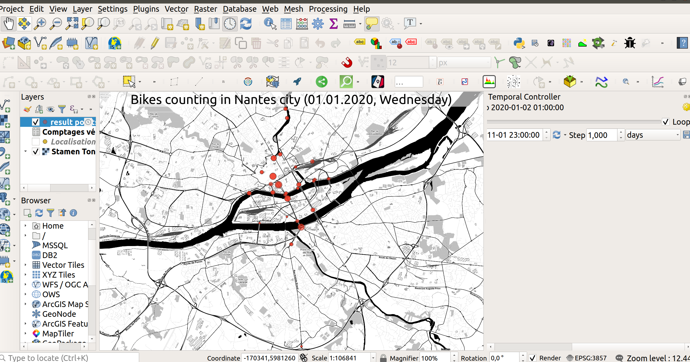

# Animation of bike counting in Nantes city

## Data

### GeoJSON points de comptage

Page https://data.nantesmetropole.fr/explore/dataset/244400404_comptages-velo-nantes-metropole-boucles-comptage/table/?disjunctive.boucle_num&disjunctive.libelle&sort=boucle_num

GeoJSON https://data.nantesmetropole.fr/explore/dataset/244400404_comptages-velo-nantes-metropole-boucles-comptage/download/?format=geojson&timezone=Europe/Berlin&lang=fr

### Comptages quotidiens

Page https://data.nantesmetropole.fr/explore/dataset/244400404_comptages-velo-nantes-metropole/table/?disjunctive.boucle_num&disjunctive.libelle&disjunctive.jour_de_la_semaine&sort=jour&q.timerange.jour=jour:%5B2021-11-01+TO+2021-11-01%5D

CSV https://data.nantesmetropole.fr/explore/dataset/244400404_comptages-velo-nantes-metropole/download/?format=csv&timezone=Europe/Berlin&lang=fr&use_labels_for_header=true&csv_separator=%3B

## Pre-processing

    wget -O points-comptages-velo-nantes-metropole.geojson  "https://data.nantesmetropole.fr/explore/dataset/244400404_comptages-velo-nantes-metropole-boucles-comptage/download/?format=geojson&timezone=Europe/Berlin&lang=fr"

    wget -O comptages-velo-nantes-metropole.csv "https://data.nantesmetropole.fr/explore/dataset/244400404_comptages-velo-nantes-metropole/download/?format=csv&timezone=Europe/Berlin&lang=fr&use_labels_for_header=true&csv_separator=%3B"

    echo '<OGRVRTDataSource>
        <OGRVRTLayer name="comptages">
            <SrcDataSource relativeToVRT="1">comptages-velo-nantes-metropole.csv</SrcDataSource>
            <OpenOptions>
            <OOI key="HEADERS">YES</OOI>
            </OpenOptions>
            <SrcSQL dialect="SQlite">SELECT * FROM "comptages-velo-nantes-metropole"</SrcSQL>
        </OGRVRTLayer>
        <OGRVRTLayer name="points">
            <SrcDataSource relativeToVRT="1">points-comptages-velo-nantes-metropole.geojson</SrcDataSource>
            <SrcSQL dialect="SQlite">SELECT * FROM "points-comptages-velo-nantes-metropole"</SrcSQL>
        </OGRVRTLayer>
    </OGRVRTDataSource>' >| joined-data.vrt

    echo '"String","String","String","Integer","Integer","Integer","Integer","Integer","Integer","Integer","Integer","Integer","Integer","Integer","Integer","Integer","Integer","Integer","Integer","Integer","Integer","Integer","Integer","Integer","Integer","Integer","Integer","Integer","String","Integer","String","Date","String"' >| comptages-velo-nantes-metropole.csvt

    ogr2ogr -f GPKG result.gpkg -sql "SELECT comptages.*, \"Total\", points.geometry FROM comptages LEFT JOIN points ON PRINTF('%04d', boucle_num) = \"Numéro de boucle\"" -dialect SQLITE joined-data.vrt -nln points_with_comptages

Then, we've made some change in a QGIS project named `stations-velo.qgz`

and exported images using Temporal Controller Panel export function

## Post-processing to videos

Convert resulting images from Temporal Controller Panel

    ffmpeg -framerate 10 -pattern_type glob -i '*.png' -vf "pad=ceil(iw/2)*2:ceil(ih/2)*2" -c:v libx264 -pix_fmt yuv420p out.mp4

<video controls>
  <source src="out.mp4" type="video/mp4">
  
Votre navigateur ne prend pas en charge les vidéos HTML5.
     Voici <a href="out.mp4">un lien pour télécharger la vidéo</a>.

</video>
