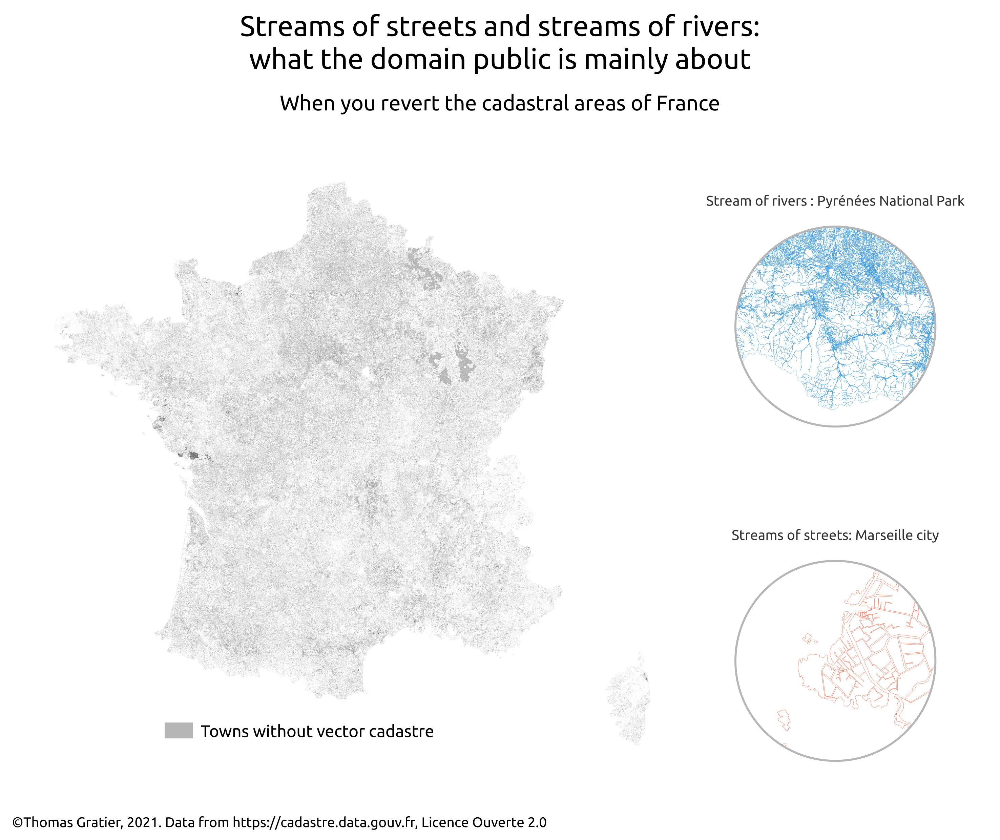

# Day 3 polygons

## Data processing


It take something like 10 eto 14 hours to process

```
depts=("01" "02" "03" "04" "05" "06" "07" "08" "09" "10" "11" "12" "13" "14" "15" "16" "17" "18" "19" "21" "22" "23" "24" "25" "26" "27" "28" "29" "2A" "2B" "30" "31" "32" "33" "34" "35" "36" "37" "38" "39" "40" "41" "42" "43" "44" "45" "46" "47" "48" "49" "50" "51" "52" "53" "54" "55" "56" "57" "58" "59" "60" "61" "62" "63" "64" "65" "66" "67" "68" "69" "70" "71" "72" "73" "74" "75" "76" "77" "78" "79" "80" "81" "82" "83" "84" "85" "86" "87" "88" "89" "90" "91" "92" "93" "94" "95" "971" "972" "973" "974" "976")


for dep in "${depts[@]}";
  do ogr2ogr "cadastre-${dep}-parcelles-merged.shp" \
             -dialect SQLite \
             -sql "SELECT commune, ST_UNION(geometry) AS geometry, sum(area(geometry)) AS area, count(commune) as count FROM parcelles GROUP BY commune" \
             "/vsizip/vsicurl/https://cadastre.data.gouv.fr/data/etalab-cadastre/2021-07-01/shp/departements/${dep}/cadastre-${dep}-parcelles-shp.zip/parcelles.shp"
done;

for dep in "${depts[@]}";
  do ogr2ogr -f CSV "cadastre-${dep}-communes.csv" \
             -dialect SQLite \
             -sql "SELECT id, nom, area(geometry) as area FROM communes" \
             /vsizip/vsicurl/https://cadastre.data.gouv.fr/data/etalab-cadastre/2021-07-01/shp/departements/${dep}/cadastre-${dep}-communes-shp.zip/communes.shp
done;


for dep in "${depts[@]}";
  do wget "https://cadastre.data.gouv.fr/data/etalab-cadastre/2021-07-01/shp/departements/${dep}/cadastre-${dep}-parcelles-shp.zip"
     rm parcelles.*
     #rm parcelles_fixed.*
     unzip "cadastre-${dep}-parcelles-shp.zip"
     #qgis_process run 'native:fixgeometries' --INPUT=parcelles.shp --OUTPUT=parcelles_fixed.shp
     ogr2ogr "cadastre-${dep}-parcelles-merged.shp" \
             -makevalid \
             -dialect SQLite \
             -sql "SELECT commune, ST_UNION(ST_buffer(geometry, 0)) AS geometry, cast(round(sum(area(geometry)), 0) as numeric(14,10)) AS area, count(commune) as count FROM parcelles GROUP BY commune" \
             "parcelles.shp"
done;
```


## QGIS project

Open it after processing

## Result overview


